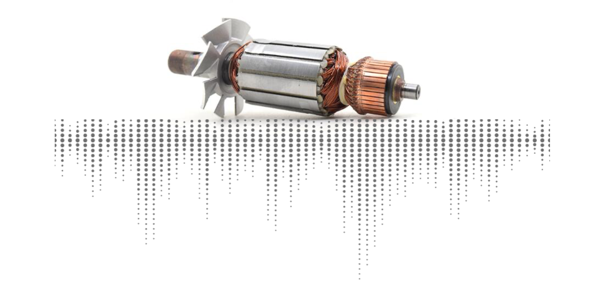

# Predictive Maintenance using Accoustic Emissions

## About the project
This project was carried out under the supervision of a doctoral student in mechanics, a teacher researcher in mechanics and by a student in the field of data sciences (myself) of the University of Technology of Compiègne (UTC) with the aim of studying the various existing tracks for predictive maintenance and their way of development.

## About predictive maintenance
In order to retain customers, increase profits and lower production costs, it is essential for it is essential for a company to be competitive on the market and to optimize and to optimize its maintenance process. Having a reliable production line with automated maintenance allows to change parts at the right time to avoid breakdowns and possible malfunctions.

When we talk about quality management system, the ISO 1900 standard is essential. Planning maintenance allows to respect the requirements of this system of this system and to gain the confidence of its suppliers and customers. It is a a recognized guarantee of quality that allows industries to be more efficient in their their organization. By anticipating maintenance, you increase customer satisfaction because stock and production shortages are avoided. In addition, you increase your internal efficiency by reducing repair costs, by increasing the life span of the infrastructure and the working conditions.

On the surface, the maintenance categories all look interchangeable, but there are nuanced differences between reactive, preventive, proactive, and predictive maintenance.

## Aim of the project
Here the goal is to design a predictive maintenance system by predicting the occurrence of defects in motors using the noise emitted by the motors to determine the type of problem. There are 3 types of defects: inner, outer, and roller.

When the engine rotates, the sounds is different and so if we record the sound emitted by the engine, we can predict whether or not the engine is broken and what kind of problem there is.

During this project, I will study three different to answer the initial problem: one using CNN, an other one using feature extraction and a combinaison of both solutions.
