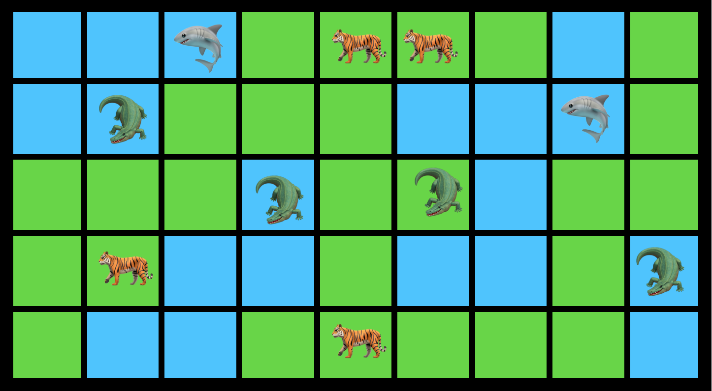

# Minesweeper Game Solver

## Subject

We consider a **2D world** in the form of a grid of size M*N (M rows and N columns). The edges are not connected.

A cell is either of **terrestrial type or of aquatic type**.
Sometimes you can find dangerous animals: **tigers** 🐯, 🦈 **sharks**, and 🐊 **crocodiles** on the boxes.

Tigers live on land, sharks live in water, and crocodiles are able to live in both habitats. Only one animal can be on the same square.
At the beginning, the player is given M, N, the number of tigers, the number of sharks and the number of crocodiles, the number of land and the number of sea and possible statistics on the difficulty of the map (e.g. the 3BV index).

To limit the randomness, a safe starting square is also given.
The boxes without animals have information about the animals in the vicinity, in the form of a triplet of 3 integers [int, int, int]. This triplet contains respectively the number of tigers, the number of sharks and the number of crocodiles in the vicinity of the cell.
3 actions are possible each turn: **discover** a tile (discover), **guess** a tiger or a shark or a crocodile (guess) and finally discover at once all the undiscovered squares around a square where all the animals have already been found (**chord**).
Any error results in the death of the explorer and the end of the map.

## Aim

We ask to realize an artificial player able to communicate with a referee server, to communicate its moves and to take into account the information provided in return, in order to guess the location of all the animals and to discover all the other squares.
The chosen solution is the use of a SAT (Propositional Satisfiability Problem) solver driven by a program written in Python.

